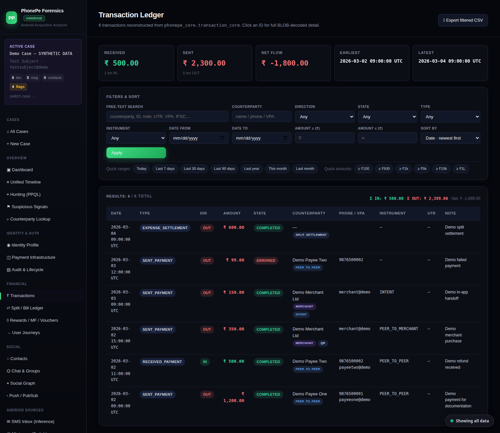
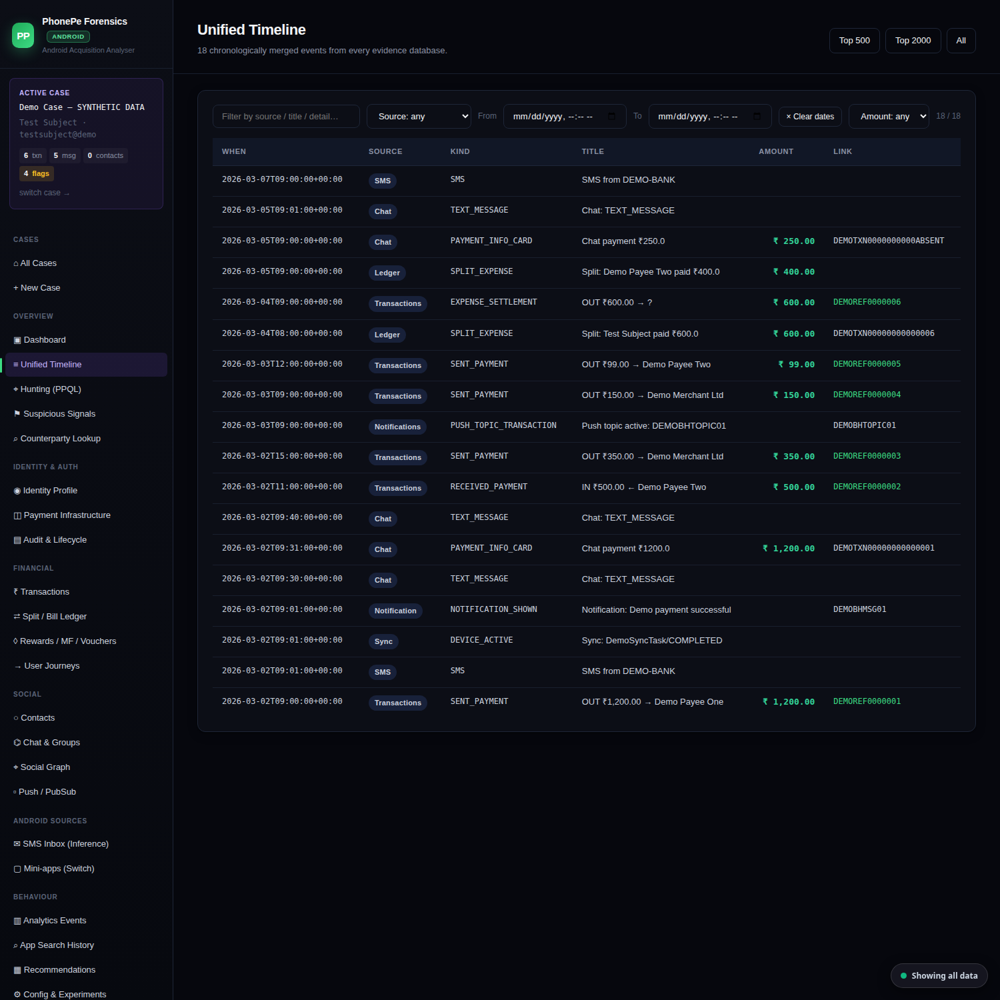
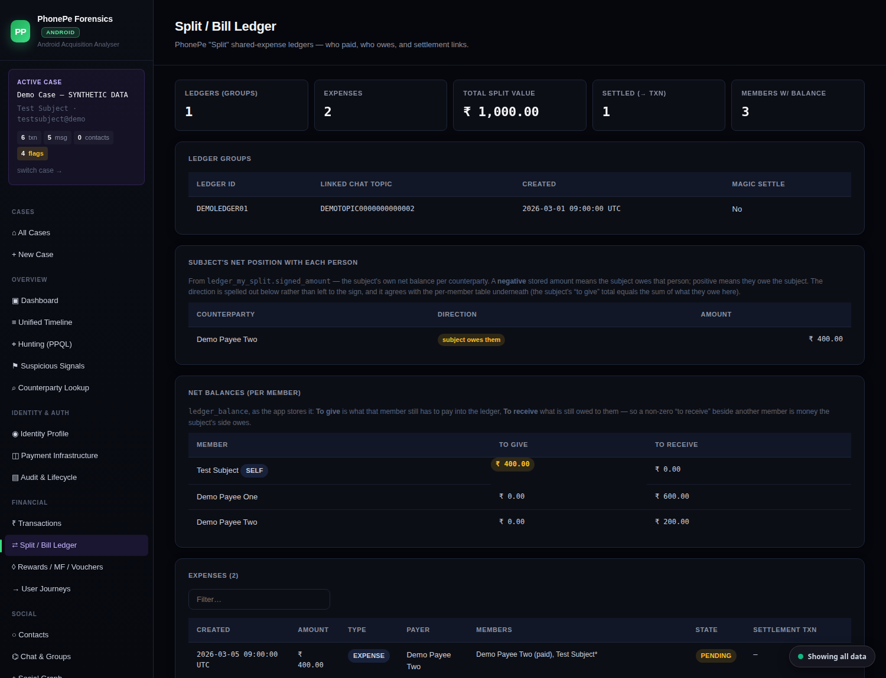
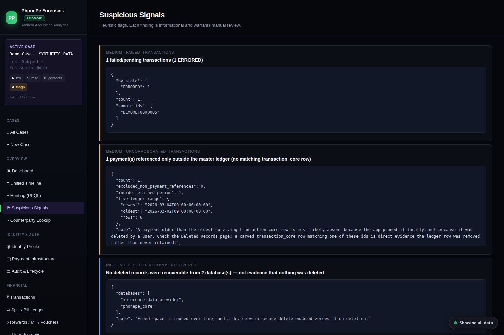
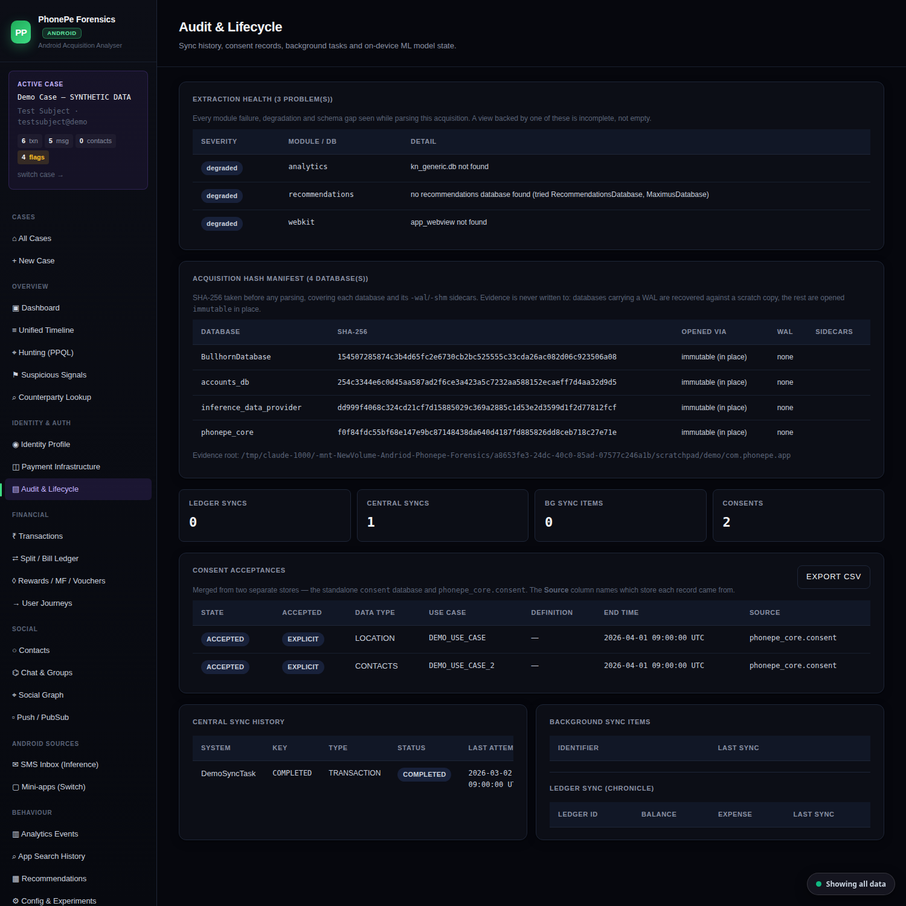
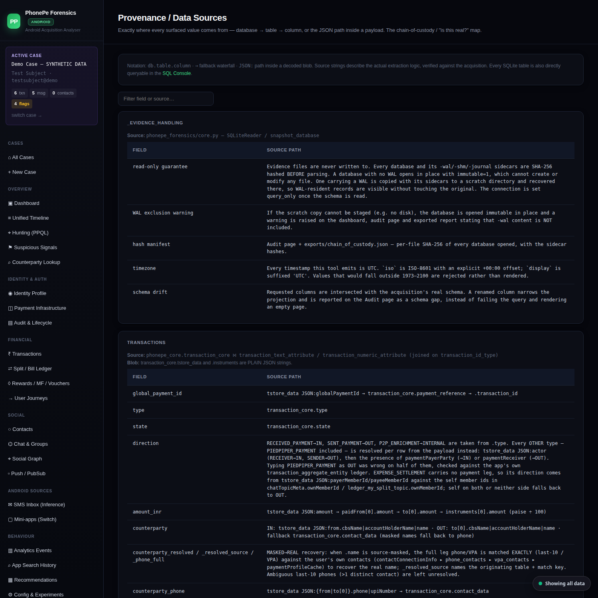

# PhonePe Android Forensics

**An offline analyser for PhonePe Android app data.** Point it at an extracted
`com.phonepe.app` folder and it reconstructs transactions, chat, contacts, the split/bill
ledger and identity into a unified timeline, a social-financial graph and suspicious-signal
findings — in a browser, with the source of every field one click away.

It is **read-only by construction**: the evidence directory is hashed before parsing and is
never written to.


> ⚠️ **Handles real personal data.** A PhonePe acquisition contains a person's complete
> financial, social and identity history. Use only on evidence you are authorised to examine.
> The tool never writes to evidence, but **never commit acquisitions, generated output, or the
> case registry** — they are excluded by `.gitignore` for this reason.

---

## Contents

**Getting started**
- [What this is (and is not)](#what-this-is-and-is-not)
- [Quick start](#quick-start)
- [What you feed it](#what-you-feed-it)

**Using it**
- [Screens](#screens)
- [What it surfaces](#what-it-surfaces)
- [PPQL — the query language](#ppql--the-query-language)
- [Exports](#exports)

**How it works**
- [Architecture](#architecture)
- [Repository layout](#repository-layout)

**Why you can rely on it**
- [The read-only guarantee](#the-read-only-guarantee)
- [Timestamps](#timestamps)
- [Masked → real identity recovery](#masked--real-identity-recovery)
- [Correlation rules](#correlation-rules)
- [Deleted-record recovery](#deleted-record-recovery)
- [Schema drift](#schema-drift)

**Reference**
- [Limitations](#limitations)
- [FAQ](#faq)
- [Development & testing](#development--testing)
- [Credits](#credits)
- [Upstream & license](#upstream--license)

---

## What this is (and is not)

**It is** an *analysis* tool. You give it data that has already been extracted from a device;
it parses, correlates and presents that data, and shows its working.

**It is not** an acquisition tool. It does not talk to phones, root devices, or pull data. Use
Cellebrite, MSAB XRY, ADB on a rooted device, or any other extraction method first.

Coverage for Indian fintech apps is thin in the general-purpose suites — you can usually pull
the files, but turning PhonePe's UPI payment flows, in-app chat and split ledgers into
something an examiner can work with is largely left to you. That gap is what this fills.

**Who it's for:** DFIR examiners, incident responders, and anyone who has a lawful PhonePe
extraction and needs to understand it.

---

## Quick start

Requires **Python 3.9+**. The only runtime dependency is Flask.

```bash
git clone https://github.com/Mihir-Choudhary/Andriod-Phonepe-Forensics.git
cd Andriod-Phonepe-Forensics
pip install -r requirements.txt
python run.py 127.0.0.1:8754
```

Open the printed URL → **+ New Case** → point it at the extracted `com.phonepe.app` folder →
**Process**.

Everything runs locally. The tool makes no network requests, and binding to `127.0.0.1` keeps
it off the network entirely.

Want to try it without evidence? Build the synthetic case — see
[Development & testing](#development--testing).

---

## What you feed it

The PhonePe package data directory from a full-filesystem / rooted extraction:

```
.../data/data/com.phonepe.app/          ← select THIS folder
├── databases/                          Room SQLite — phonepe_core holds transactions,
│                                        chat, contacts, ledger (~160 tables)
├── shared_prefs/                       XML key/value (tokens, device IDs, flags)
├── files/                              DataStore, crashlytics, cached blobs
└── app_webview/                        Chromium cookies / local storage
```

A case is valid as soon as `databases/phonepe_core` exists. Everything else is optional —
absent sources are reported as *degraded* on the dashboard and Audit page, never silently
skipped.

---

## Screens

*All screenshots below use a synthetic demo case — no real data. See
[Development & testing](#development--testing) for how it is built.*

**Transaction ledger** — direction, counterparty, state and instrument per row, with
`MERCHANT` / `PEER_TO_PEER` classification and `QR` / `INTENT` initiation tags read from the
payload rather than inferred.



**Unified timeline** — every evidence database merged into one chronology: transactions, chat,
ledger splits, SMS, push notifications and device-sync events, each labelled with its source.



**Chat thread** — reconstructed conversation with payment cards inline. The participants table
shows masked→real recovery working: a full number recovered where the chat itself stored only
`******0001`, labelled as recovered rather than presented as if it were stored.


**Split / bill ledger** — who paid, who owes, and the settlement→transaction link. The
subject's net position spells the direction out in words instead of leaving it to a sign.



**Social-financial graph** — one node per identifier, with transaction and chat activity joined
onto it and each node's evidence sources listed.


**PPQL hunting** — an SPL-style query language over every index, with CSV export.


**Suspicious signals** — heuristic findings, each carrying its supporting data. Note the two
deliberately cautious ones: a "no deleted records recovered" finding that states outright it is
*not* evidence nothing was deleted, and an uncorroborated-payments finding that reports the
ledger's retained date range so absence-by-retention is not mistaken for deletion.



**Audit & lifecycle** — the SHA-256 manifest taken *before* parsing, how each database was
opened (`immutable` in place vs recovered against a scratch copy), and every extraction
degradation.



**Provenance** — the source database, table and column, or the JSON path inside a payload,
behind every field the tool displays. This page holds no case data at all: it is the tool's own
account of how it reads evidence.



---

## What it surfaces

| Area | What you get |
|---|---|
| **Transactions** | Amount, direction, counterparty, instrument, UTR, merchant, state, initiation mode, search tokens |
| **Chat & groups** (Burble) | Threads, messages, payment cards, participants with recovered identities |
| **Contacts** (Sampark) | PhonePe contacts + device phonebook, deep-linked to each person's chat thread |
| **Split / bill ledger** | Shared expenses, per-member shares, net balances, settlement→transaction links |
| **Identity** | Registered name and VPAs, device fingerprint, persistent IDs, sessions, location hints |
| **Payment infrastructure** | Linked accounts, VPAs, PSP handles, cards, wallets, mandate approvers |
| **SMS inference** | Bank SMS, matched against transactions |
| **Notifications** | Decoded push payloads — title, body and deeplink as the user saw them |
| **Mini-apps** (Switch), **analytics**, **config** | Third-party apps opened, event queues, feature flags |
| **Derived views** | Unified timeline, social graph, suspicious-signal findings, counterparty profiles |
| **Raw layer** | Every table (browsable + CSV), all shared_prefs, files & DataStore, a read-only SQL console |
| **Provenance** | The DB/table/column or JSON path behind every surfaced field |

---

## PPQL — the query language

An SPL-inspired pipeline language over every index, on the **Hunting** page.

```
transactions | where direction = "OUT" and amount_inr > 5000 | sort amount_inr desc | head 20
chat_messages | where sender_phone_masked like "*9876" | stats count by sender_name
contacts     | where on_phonepe = true | top 10 region
timeline     | where source = "Chat" | sort when_iso desc
```

| Command | Purpose |
|---|---|
| `where COND` | Filter rows (`= != < <= > >=`, `like`, `matches`, `contains`, `startswith`, `in [a,b]`) |
| `sort F [asc\|desc]` | Order results |
| `head N` / `tail N` | Limit rows |
| `table F1,F2,…` | Select columns |
| `stats count by F` / `stats sum(F) by G` | Group and aggregate |
| `top N field` | Most common values |
| `dedup field` | Deduplicate |
| `rename F as G` | Rename a column |

Every `*_iso` field is UTC ISO-8601, so string comparison sorts chronologically; each also has
a numeric `*_epoch_ms` twin. Results export straight to CSV.

---

## Exports

**Export Evidence** produces a self-contained set: per-module CSVs, a master JSON of everything
parsed, a standalone HTML report, and `chain_of_custody.json` carrying the SHA-256 manifest and
the tool's own record of how each database was opened.

CSV output neutralises formula injection (`=`, `+`, `-`, `@` prefixes), so a cell containing
attacker-controlled text cannot execute when the file is opened in a spreadsheet.

---

## Architecture

```
com.phonepe.app/  ──►  AndroidCasePaths        resolve databases/ shared_prefs/ files/ app_webview/
                                               a case is valid ⇔ databases/phonepe_core exists

                  ──►  extract_*(paths)        one module per evidence area; each returns a
                                               NORMALIZED dict. Failures are recorded, never raised —
                                               a broken source degrades that panel, not the run.

                  ──►  case.data               the platform-agnostic contract.
                                               EVERYTHING downstream reads only this.

                  ──►  correlator              timeline · social graph · corroboration · signals
                       carver                  deleted-record recovery
                       hunt                    PPQL indexes + query engine
                       reports                 CSV / master JSON / HTML + chain of custody

                  ──►  webapp (Flask)          pages + CSV endpoints, one active case
                       case_manager            JSON registry, LRU of loaded cases
```

The important line is **`case.data`**. Parsers sit on one side of it and every consumer —
timeline, graph, findings, hunt, reports — on the other. Consumers never touch a database or
know which platform produced the data, which is why this Android build could reuse the whole
engine rather than reimplementing it.

`phonepe_forensics/` is the platform-agnostic engine (shared with the upstream iOS tool);
`phonepe_android/` is the only Android-shaped code.

---

## Repository layout

```
run.py                       entry point — python run.py 127.0.0.1:8754

phonepe_forensics/           platform-agnostic engine
  core/common.py             SQLiteReader, evidence snapshots, timestamps, hashing
  core/android.py            com.phonepe.app layout, JSON payloads, shared_prefs
  core/ios.py                plist, binarycookies, NSKeyedArchiver, iOS containers
  carver.py                  deleted-record recovery
  correlator.py              timeline, social graph, corroboration, findings
  hunt.py                    PPQL indexes and query engine
  reports.py                 CSV / master JSON / HTML report / chain of custody
  case_manager.py            case registry, LRU of loaded cases
  webapp.py                  Flask routes
  templates/ static/         UI

phonepe_android/             Android parser
  core_android.py            path resolution + re-export shim
  extractors_android.py      one extract_* function per evidence area
  case_android.py            AndroidCase — orchestration, timeline, findings
  provenance_android.py      the per-field source map behind the Provenance page

notes/
  smoke_test.py              headless end-to-end run of one acquisition
  make_demo_acquisition.py   builds the synthetic case behind the screenshots
  demo_schema.sql            table shapes for that fixture (CREATE statements only)

docs/screenshots/            README images — synthetic data only
```

`phonepe_forensics.core` re-exports common + android + ios, so
`from phonepe_forensics.core import X` works regardless of which module `X` lives in.

---

## The read-only guarantee

The evidence directory is never written to, so the tool works on a read-only mount and the
folder stays byte-identical to the manifest taken at seizure.

- Every database and its `-wal` / `-shm` / `-journal` sidecars are **SHA-256 hashed before
  parsing**. The manifest appears on the Audit page and in `chain_of_custody.json`.
- A database with **no WAL** is opened in place with `immutable=1`, which cannot create or
  modify a file. (SQLite's ordinary `mode=ro` cannot do this: it still needs to create a `-shm`
  beside the database, which fails on read-only media and mutates the folder when it succeeds.)
- A database **carrying a WAL** is copied with its sidecars to a scratch directory and recovered
  *there*, so WAL-resident records are included without touching the original. The connection is
  switched to `query_only` once the schema is read.
- If a scratch copy cannot be staged, the database is opened `immutable` in place and a warning
  is raised on the dashboard, the Audit page **and** the exported report stating that `-wal`
  content is not included.

**Verify it rather than trusting it** — hash the folder before and after a run:

```bash
P=/path/to/com.phonepe.app
find "$P" -type f -exec sha256sum {} \; | sort -k2 > before.sha256
# ...run the tool...
find "$P" -type f -exec sha256sum {} \; | sort -k2 > after.sha256
diff before.sha256 after.sha256 && echo "evidence byte-identical"
```

## Timestamps

**All timestamps are UTC**, stated explicitly: `iso` is ISO-8601 with a `+00:00` offset and
`display` is suffixed `UTC`. Values that would fall outside 1973–2100 are rejected rather than
rendered, so a corrupt field cannot appear as a plausible date.

The timestamp embedded in a PhonePe transaction ID is shown as raw wall-clock digits and
labelled **unvalidated** — the issuing server's timezone is undocumented, so it is never treated
as independent corroboration.

## Masked → real identity recovery

Where PhonePe source-masks a counterparty (`******1478`), the tool recovers the real identity by
**exact** cross-table lookup — connection_id, member_id, last-10 phone, or VPA — against the
user's own contacts, and labels each recovered name by origin (*saved in PhonePe* vs
*phonebook*), so you can see both.

Matches are exact only. A last-10 phone number that maps to more than one distinct contact is
left **unresolved rather than guessed**, and a name that was never masked is never churned.

## Correlation rules

- **The social graph attributes chat by connection id, never by display name** — two contacts
  who share a name keep their own threads and their own message counts. A thread whose
  counterparty cannot be resolved to a connection is counted against the thread and marked as
  such, rather than attached to a guessed name.
- **Bank-SMS corroboration** matches exact paise, within ±30 minutes, one-to-one, nearest in
  time first — so a transaction cannot be credited to an SMS belonging to a different payment of
  a similar amount, and the confirmed/uncorroborated counts do not depend on row order.
- **Unknown stays unknown.** A missing column or absent JSON key renders as `—`, never as "No".
  Absence of evidence is not recorded as evidence of absence anywhere in the output.

## Deleted-record recovery

Deleting a row does not erase it. SQLite unlinks the cell and returns its bytes to one of
several pools, which usually still hold the original payload. The **Deleted Records** page walks
all of them and reconstructs what it finds:

| Pool | What it is |
|---|---|
| `freelist` | Whole pages released back to the database |
| `freeblock` | A released cell inside a live page |
| `page-slack` | A page's unallocated middle |
| `pre-wal-image` / `wal-superseded` | A page version the WAL replaced — where a WAL-recorded deletion leaves the original row intact |
| `journal` | A rollback journal pre-image |

Recovered rows are matched against the real table schemas by column count and affinity, then
**excluded if they are still present in the live table**, so only genuine deletions are
reported. Each carries its pool, page, byte offset and source file.

Three honesty constraints are built in:

1. A record that fits more than one table is reported against **all** of them and flagged
   ambiguous, rather than assigned to one.
2. Freeing a cell overwrites the record's first serial type, so some rows are recovered with
   their leading field's boundary *inferred*. Those are marked `partial`, and confidence is
   `high` only where the record's extent was confirmed structurally. Extent confidence and value
   confidence are reported separately.
3. **An empty result is never presented as proof that nothing was deleted.** Freed space is
   reused over time, and a device with `secure_delete` on zeroes it immediately. Whether freed
   content survived is reported from what was actually recovered — not from
   `PRAGMA secure_delete`, which is per-connection and would describe the examining machine
   rather than the phone.

## Schema drift

PhonePe ships schema changes. A hard-coded `SELECT a, b, c FROM t` is intersected with the
acquisition's real schema: absent columns come back as `None` and the gap is reported on the
Audit page. A renamed column narrows the projection and is flagged — it does not fail the query
or, worse, render an empty page that looks exactly like an acquisition with no such data.

---

## Limitations

- **Three databases are SQLiteCrypt-encrypted** (`AccountAggregatorDatabase`, `mdb`, and a
  UUID-named DB — each carries a `SQLitecrypt.com` header) and are recorded as
  present-but-not-decryptable. The whole-DB AES key is not on disk: the encrypted passphrase
  lives in `shared_prefs/common-encrypted-shared-pref.xml` (AndroidX
  `EncryptedSharedPreferences`), wrapped by a Tink keyset, wrapped by an **Android Keystore**
  master key whose bytes live in the device **TEE/StrongBox** and never touch the file system. A
  static image cannot decrypt them; that needs the device's secure hardware.
- **Carving targets a fixed table list** to keep the scan proportionate and interpretable, and
  it dominates runtime — expect most of a run's wall time to be deleted-record recovery.
- **Documents over 8 MB under `files/`** are indexed but not parsed. This is reported, not
  silent.
- **"0 schema gaps" does not mean "everything was read."** Many tables are app catalogue and
  index data that no curated module reads; they remain browsable in the raw layer.

---

## FAQ

**Does this modify the evidence?**
No. See [the read-only guarantee](#the-read-only-guarantee) — and verify it with the hash
recipe there rather than taking the claim on faith.

**Does it need internet?**
No. It runs entirely locally and makes no outbound requests.

**Can I point it at a single `.db` file?**
No. It needs the directory containing `databases/`, because it correlates across databases.
Stage a loose file into that structure first.

**It says a source is "degraded" — is that a bug?**
Usually not. It means that source was absent from this acquisition. The distinction matters: a
degraded panel is *incomplete*, not *empty*, and the Audit page names every one.

**Why is a counterparty shown as a phone number instead of a name?**
Because the acquisition stored a masked name and no exact match was found in the contact
tables. The tool will not guess — see
[masked → real recovery](#masked--real-identity-recovery).

**Nothing was recovered from the Deleted Records page. Does that prove nothing was deleted?**
No, and the tool says so explicitly. See
[deleted-record recovery](#deleted-record-recovery).

**Does it support iOS?**
Not this build — it is Android-only. iOS is covered by
[Sujay Adkesar's original tool](https://github.com/sujayadkesar/PhonePe-Forensics), and the plan
is to merge the two so one tool handles both.

---

## Development & testing

**Headless end-to-end run** — faster than clicking through every page, and the real test result
is the extraction-errors / schema-gaps report:

```bash
python notes/smoke_test.py /path/to/com.phonepe.app --json result.json
```

It validates the layout, times each extractor, reports errors and schema gaps, builds every
derived view, exports the full set, and sweeps every route. Exit code 0 means clean.

**Synthetic test case** — build a fabricated acquisition with no real data in it. This is what
the screenshots come from, and it is the way to try the tool without evidence:

```bash
python notes/make_demo_acquisition.py /tmp/demo-case
python run.py 127.0.0.1:8754      # then point a new case at /tmp/demo-case/com.phonepe.app
```

It fills PhonePe's real table shapes (`notes/demo_schema.sql` — CREATE statements only) with
invented rows: a subject named `Test Subject`, counterparties `Demo Payee One` / `Demo Merchant
Ltd`, and numbers in the `9876500000` documentation range. Using the real schema is deliberate —
the fixture goes through the same extractors, correlator and templates as evidence does, so it
exercises real behaviour rather than a mock.

If you regenerate the screenshots, serve the demo from a directory that has never held a real
case: the case registry is created relative to the working directory, and the active case's
name, subject and root are injected into *every* page.

---

## Credits

This tool was **inspired by [Sujay Adkesar](https://github.com/sujayadkesar)'s
[PhonePe-Forensics](https://github.com/sujayadkesar/PhonePe-Forensics)**. That repository was the
reference used to code this Android tool and to understand the PhonePe forensic architecture —
the normalized data contract, the correlator / timeline / social-graph engine, the hunt console
and the report layer.

That design is why an Android port was tractable at all: because every consumer reads only
`case.data`, adding a platform meant writing new extractors rather than a second tool. Full
credit and thanks to Sujay for the original work.

> 🔜 **Coming soon:** this Android tool will be **merged back into Sujay's repo** so there is a
> **single tool that handles both iOS and Android** instead of two. You'll pick the platform on
> launch and the analyser loads the matching parser and layout.

## Upstream & license

Vendored from `github.com/sujayadkesar/PhonePe-Forensics` at commit `007473a`, then reduced to
an Android-only distribution. The parser and shared engine were copied rather than submoduled,
so fixes made upstream after that commit must be re-applied here.

See [`LICENSE`](LICENSE).
